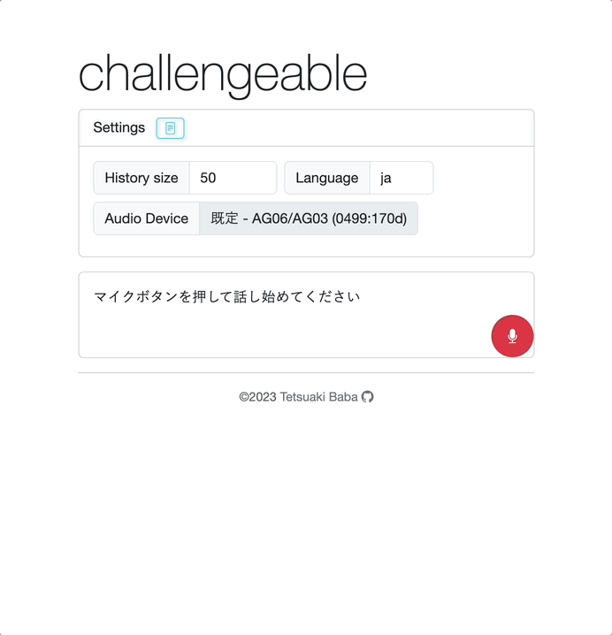

# Challengeable
Challengeableは音声認識区分によって会話を録音し、ユーザの「噛み」をその場で検証するためのツールです。「いま〇〇っていってなかった？」をその場で手軽に確かめることができるようになります。汎用的な波形編集ソフトウェアではどの部分で噛んだのかをすぐに見つけることが困難で、即座に該当箇所を再生するには熟練の技術が必要とされています。そこで本システムでは、自動翻訳区切りを参考にして、即座に噛んだであろう箇所を見つけ、ワンクリックで録音箇所を再生することを可能としました。

## DEMO
以下のリンクからお試しください。
  * https://tetsuakibaba.github.io/challengeable/

## Inspired
本ソフトウェアの開発にあたり、ニッポン放送オードリーのオールナイトニッポンにおけるチャレンジシステムに強く影響をうけております。本システム名はそれに準じたチャレンジャブルという名前にしています。チャレンジシステムをオンラインコミュニケーション環境下においてなるべく手軽に実現することを目指しています。

## Compatibility
  * Only Chrome browser (MacOS, windows, linux)
## Requirement
  * p5.js
  * p5.sound
  * p5.speech
  * Bootstrap
  * jQuery

## Author
* Tetsuaki Baba: https://tetsuakibaba.jp
* Affiliation: Tokyo Metropolitan University

## Reference
  * p5js libraries: https://p5js.org/libraries/
  * Bootstrap: https://getbootstrap.com